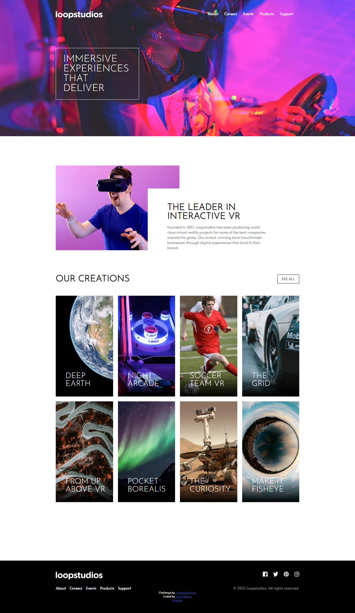
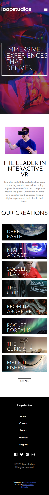

# Frontend Mentor - Loopstudios landing page solution

## English
This is a solution to the [Loopstudios landing page challenge on Frontend Mentor](https://www.frontendmentor.io/challenges/loopstudios-landing-page-N88J5Onjw). Frontend Mentor challenges help you improve your coding skills by building realistic projects.

## Português
Essa é uma solução para [Loopstudios landing page challenge on Frontend Mentor](https://www.frontendmentor.io/challenges/loopstudios-landing-page-N88J5Onjw). O site Frontend Mentor challenges ajuda na melhoria das habilidades com códigos através da costrução de projetos realistas.

## Table of contents

- [Overview](#overview)
  - [The challenge](#the-challenge)
    -[English](#English)
    -[Português](#Português)
  - [Screenshot](#screenshot)
  - [Links](#links)
- [My process](#my-process)
  - [Built with](#built-with)
- [Author](#author)

**Note: Delete this note and update the table of contents based on what sections you keep.**

## Overview

### The challenge

#### English
Users should be able to:

- View the optimal layout for the site depending on their device's screen size(width minimal: 320px )
- See hover states for all interactive elements on the page

#### Português
Usuários poderão:

- Ver o layout otimizado para o site independente do tamanho da tela(largura minima: 320px)
- Observar os estados diferentes ao passar o mouse/dedo em todos elementos que possuem esse tipo de interação

### Screenshot

### Links

- Live Site URL: [Add live site URL here](https://luqta.github.io/loopstudios-landing-page-main/)

## My process

### Built with

- Semantic HTML5 markup
- CSS custom properties
- Flexbox
- Mobile-first workflow
- Javascript

## Author

- Linkedin [Lucas Mateus](https://www.linkedin.com/in/lucas-mateus-5543901a0/)
- Github - [@Luqta](https://www.github.com/Luqta)